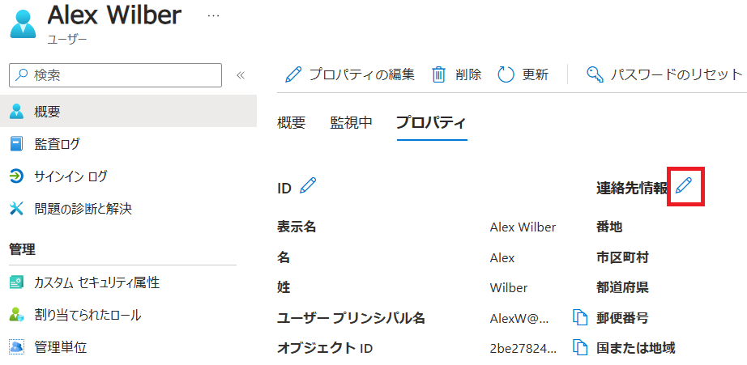

# **ラボ 01: Microsoft Teams を管理する**


## **Microsoft 365 ユーザー インターフェイス**

Microsoft クラウド ツールの動的な性質を考えると、このトレーニング コンテンツの開発後にユーザー インターフェイス (UI) が変更される場合があります。これは、この実習ラボ マニュアルに記載されている詳細な手順と一致しない UI の変更として現れます。

Microsoft World-Wide Learning チームは、このような変更が通知され次第、このトレーニング コースを更新します。ただし、クラウド更新の動的な性質を考えると、このトレーニング コンテンツが更新される前に UI の変更が発生する可能性があります。**これが発生した場合は、変更に適応し、必要に応じてラボの演習で作業する必要があります。**

- ## **ラボのシナリオ**

  このコースのラボでは、Contoso Ltd の Teams 管理者である Joni Sherman の役割を引き受けます。必要な Teams 管理者ロールがパイロット チーム メンバーに割り当てられていることを確認し、ユーザーへのライセンス割り当てを確認するように求められます。Contoso での Microsoft Teams ロールアウトの一環として、パイロット チームのメンバーが、Teams 管理センター、そのメニュー、PowerShell コマンドレットを使用して日常の管理タスクを処理する方法に精通していることを確認する必要があります。仮想化されたラボ環境に Microsoft 365 を既に実装しており、M365 管理センターからの Microsoft 365 グループの作成と、Teams  Web クライアントを使用した新しいチームをテストするように依頼されました。また、Teams 更新ポリシーを使用して Teams プレビュー機能を調べるためのアクセスも有効にします。パイロット チームが Teams 管理センターと Microsoft 365 管理センターの機能の調査とテストを完了したら、チームの作成に制限を適用しながら、グループとチームの名前付けポリシーと有効期限ポリシーの作成と構成のベスト プラクティスに従うようにガイドする必要があります。

  パイロット プロジェクトを開始したばかりで、 2 つの仮想マシンと、異なるユーザーを持つテナントが既にあります。

  - ジョニ・シャーマン(JoniS@YourTenant.OnMicrosoft.com)  **Teams 管理者**
  - パティ・フェルナンデス(PattiF@YourTenant.OnMicrosoft.com)  **Teams デバイス管理者**
  - アラン・デヤング(AllanD@YourTenant.OnMicrosoft.com) **Teamsコミュニケーションサポートエンジニア**
  - アレックス・ウィルバー (AlexW@YourTenant.OnMicrosoft.com)  **カナダのレギュラーパイロットユーザー**
  - リン・ロビンズ(LynneR@YourTenant.OnMicrosoft.com)  **通常のパイロットユーザー**
  - ディエゴ・シチリアーニ(DiegoS@YourTenant.OnMicrosoft.com)  **通常のパイロットユーザー**

- ## **目標**

  このラボを完了すると、次のことができるようになります。

  - Teams 管理者ロールをユーザーに割り当てる
  - ユーザーのライセンス割り当てを確認する
  - Teams 管理センターとそのメニューを理解する
  - Teams PowerShell モジュールをインストールし、そのコマンドレットを調べる
  - M365 管理センターから Microsoft 365 グループを作成する
  - Teams Web クライアントを使用して新しいチームを作成する
  - 有効期限ポリシーの構成
  - 新しいチームの作成をセキュリティ グループのメンバーに制限する
  - 名前付けポリシーを作成する
  - Teams プレビュー機能へのアクセスを有効にする

## **ラボのセットアップ**

- **所要時間:** 60 分

## **指示**

### **はじめに**

- このコースのラボは、Contoso Ltd. Corporation での Microsoft Teams 展開用に準備されています。Contoso は、Microsoft 365 クラウドのみの展開を実行しています。ラボ環境は、Microsoft 365 展開で Microsoft Teams を管理できるように、この方法で特別に設計されています。ラボの手順を完了するために、2 つの仮想マシンと Microsoft 365 テナントが提供されます。

  #### **1. ラボ仮想マシンにサインインする**

  このコースのラボでは、次の 2 つの仮想マシンを使用します。

  - クライアント 1 VM: スタンドアロンの Windows 10 クライアント仮想マシン。
  - クライアント 2 VM: スタンドアロンの Windows 10 クライアント仮想マシン。

  **手記：** ラボ仮想マシンのサインイン手順は、インストラクターから提供されます。

  **大事な：** MS-700 ラボの演習は、クラウドのみの展開です。ローカル管理者アカウントがクライアント VM に作成されている。ドメイン アカウントではなく、ローカル管理者として VM にログインします。ログイン後、デスクトップには、使用しているマシンに応じて、CLIENT1またはCLIENT2としてログインしていることが表示されます。

  #### **2. インストールされているアプリケーションを確認する**

  VM にサインインしたら、スタート メニューを観察し、次のアプリケーションがインストールされていることを確認します。

  - Microsoft Teams

  #### **3. Microsoft 365 テナントを確認する**

  2 つの VM に加えて、次のハイライトを備えた Microsoft 365 テナントも提供されます。

  - Microsoft 365 E5 と Teams Enterprise。

  - 合計 15 ライセンス、15 ライセンスのうち 5 ライセンスが利用可能 (10 ライセンスを使用)。

  - 1 人のグローバル管理者 (MOD 管理者) と 9 人の標準ユーザーが事前に作成されています。

  - **手記：** Microsoft 365 のサインイン手順は、インストラクターから提供されます。

  - グローバル管理者 (MOD 管理者) のユーザー名は **admin@YourTenant.onmicrosoft.com** です。

  - **YourTenant.onmicrosoft.com** - これは、ラボ ホスティング プロバイダーによって提供された Microsoft 365 テナントに関連付けられているドメインです。このドメイン名の最初の部分 (YourTenant) は、ラボ ホスティング プロバイダーによって提供される一意のテナント ID です。テナント サフィックス ID であるテナント ID の YourTenantの部分は、学生ごとに一意になります。

  - **大事な：** このラボでは、特定のユーザー名 (JoniS@YourTenant.onmicrosoft.com など) でアプリにサインインするときに、**YourTenant.onmicrosoft.com** ドメイン名の入力を求められるため、これは非常に重要です。その場合は、**YourTenant** の代わりにテナント ID に割り当てられている一意のテナント サフィックス ID を入力する必要があります。

  - たとえば、テナントの電子メールが **[admin@contosolab.onmicrosoft.com](mailto:admin@contosolab.onmicrosoft.com)** の場合、一意のテナント サフィックス ID (YourTenant) は **contosolab** です。このドメインに入るときに Joni としてサインインする場合は、YourTenant を contosolab に置き換えます (例: [JoniS@contosolab.onmicrosoft.com](mailto:JoniS@contosolab.onmicrosoft.com))。

  - **勧告：** このラボでは YourTenant として記載され、トレーニング プロバイダーから提供された一意のテナント サフィックスを書き留める必要があります。しばらくすると、この名前または番号を暗記して、このコースのラボを進みます。

  - **WWLテナント - 利用規約**

    インストラクター主導のトレーニング配信の一環としてテナントが提供されている場合、テナントはインストラクター主導のトレーニングでハンズオン ラボをサポートする目的で利用可能になることに注意してください。

    テナントは、ハンズオン ラボ以外の目的で共有したり、使用したりしないでください。本講座で使用するテナントはトライアルテナントであり、授業終了後は利用・アクセスできず、延長の対象外となります。

    テナントを有料サブスクリプションに変換しないでください。このコースの一環として取得したテナントは、Microsoft Corporation の所有物であり、Microsoft はいつでもアクセスを取得して差し押さえる権利を留保します。

### **演習 1: Teams 管理者の役割とライセンスを準備する**

最初の演習では、必要な管理者ロールをユーザーに割り当て、Teams ライセンスのライセンス割り当てを確認します。これらのタスクを実行するには、既定のテナント グローバル管理者を使用します。

#### **タスク 1 - Teams 管理者ロールをユーザーに割り当てる**

このタスクでは、既定のグローバル管理者を使用して Microsoft 365 管理センターにサインインし、複数の Teams 管理者ロールを異なるユーザーに割り当てます。このタスクは、Joni Sherman のアカウントのコンテキストでほとんどのタスクを実行するため、後のタスクや演習で重要です。

1. **MOD 管理者**として Microsoft 365 管理センター (https://admin.microsoft.com/) を参照します。

   - 提供された資格情報を使用して**クライアント 1 VM** に接続します。

   - Microsoft **Edge** を開き、グローバル管理者資格情報 ( **MOD 管理者** : admin@YourTenant.onmicrosoft.com) を使用して [**https://admin.microsoft.com/**](https://admin.microsoft.com/) の **Microsoft 365 管理センター**を参照します。

     

2. 画面右上の歯車をクリックし、Microsoft 365 管理センターを日本語表記に変更してください。（詳細は別紙）

3. **Teams 管理者**ロールを **Joni Sherman** に割り当てるには

   - 左上のナビゲーション メニューを選択し、その下から [**ユーザー(Users)**] と [**アクティブなユーザー(Active users)**] を選択します。
   - [アクティブ ユーザー(Active users)] の一覧で、 **[Joni Sherman**] を検索して選択し、右側の設定ウィンドウを開きます。
   - [アカウント(Account)] タブの下の設定で、[**役割の管理(Manage roles)**] を選択します。
   - [**管理者ロールの管理(Manage admin roles)**] ウィンドウで、[**管理センターに対するアクセス許可(Admin center access)**] を選択し、下にスクロールして [**すべてをカテゴリ別に表示(Show all by category)**] を展開し、使用可能なすべてのロールを表示します。
   - **[Teams 管理者(Teams Administrator)**] チェック ボックスをオンにし、[**変更の保存(Save Changes)**] を選択します。ウィンドウの上部に管理者の役割が更新された旨のメッセージが表示され、更新が確認されます。 **ウィンドウの右上にある [X] ボタンを選択** して、[管理者ロールの管理(Manage admin roles) ]ウィンドウを閉じます。

4. **Teams デバイス管理者**ロールを **Patti Fernandez** に割り当てるには
   
   - 上記と同じ手順を繰り返し、[アクティブなユーザー] の一覧で **Patti Fernandez** を検索して選択し、**Teams デバイス管理者(Teams Device Administrator)** ロールを Patti Fernandez に割り当てます。
   
5. **Teams の通信 サポート エンジニア**の役割を **Allan Deyoung** に割り当てるには
   
   - 上記と同じ手順を繰り返し、**Teams 通信サポート エンジニア(Teams Communication Supprt Engineer)** の役割を Allan Deyoung に割り当てます。

これで、Teams 管理者ロールが正常に割り当てられました。

- チーム管理者: Joni Sherman
- Teams デバイス管理者: Patti Fernandez
- Teams 通信 サポート エンジニア: Allan Deyoung

次のタスクに進みます。

#### **タスク 2 – ユーザーのライセンス割り当てを確認する**

このタスクでは、パイロットに参加しているすべてのユーザーのライセンス割り当てを確認します。タスクの最後に、すべてのパイロット ユーザーが正しくライセンスされていることと、後のタスクの準備として Alex Wilber の場所がカナダに更新されていることを確認します。

1. **クライアント 1 VM** に接続し、**MOD 管理者**として Microsoft 365 管理センター (https://admin.microsoft.com/) を参照します。
2. Alex Wilber のロケーションをカナダに更新
   - **[ユーザー(User)**] > **[アクティブなユーザー(Active users)**] ページで、**Alex Wilber** の名前を選択します。
   - [**ライセンスとアプリ(License and apps)**]タブを選択します。
   - **[場所を選択(Select location)**]の下のドロップダウンメニューを選択し、**カナダ(Canada)** に更新します。
   - [**変更の保存(Save Changes)**] を選択します。
3. **Alex Wilber の**ライセンスを確認する
   - 同じタブの **[ライセンス(Licenses)**] セクションで、 **Microsoft 365 E5** が選択されていることを確認します。
   - **[アプリ(Apps)]** を選択して [すべてのライセンス(All Licenses)] を展開します。
   - すべてのアプリの一覧を下にスクロールし、[**Microsoft Teams**] が選択されていることを確認します。
4. 同じ手順を繰り返して、他のユーザーのライセンスを確認できます。場所は変更しないでください。

パイロットに参加しているすべてのユーザーが Teams ライセンスを所有し、Teams の操作を開始する準備ができていることを正常に検証しました。また、後のタスクの準備として、Alex Wilber の場所をカナダに変更しました。次のタスクに進みます。

最初の演習を終了したので、次の演習に進むことができます。

### **演習 2: Teams 管理ツールを探索する**

この演習では、Teams 管理センターを探索し、テナント内の Teams のチーム、ポリシー パッケージ、通話機能、その他すべての設定を管理するために必要な Teams PowerShell モジュールをインストールします。Teams 管理センターと PowerShell から可能なタスクのほとんどは実行できます。自動化用のスクリプトを作成したり、GUIでは使用できないいくつかの設定にアクセスしたりすることもできます。

これらのタスクを実行するには、Joni Sherman のアカウント (JoniS@YourTenant.onmicrosoft.com) を使用します。

#### **タスク 1 - Teams 管理センターの探索**

Teams 管理センターで Teams を管理するために使用できる設定を確認します。

1. **クライアント 1 VM** に接続し、**Joni Sherman** (JoniS@YourTenant.onmicrosoft.com) として Teams 管理センター ([https://admin.teams.microsoft.com](https://admin.teams.microsoft.com/)) を参照します。

   **手記：** Microsoft Edge の **InPrivate ウィンドウ**を使用して、さまざまな資格情報でログインできます。

2. 画面右上の歯車をクリックし、Teams 管理センターを日本語表記に変更してください。（詳細は別紙）

3. Teams 管理Joni センターの左側のナビゲーションで、[**チーム**] > **[チームを管理**] を選択します。作成すると、組織内のチームが表示されます。

4. Teams 管理センターの左側のナビゲーションで、[チーム] > **[Teams ポリシー**] を選択します。**Global (組織全体の既定)** という名前の既定の Teams ポリシーを確認できます。

他の設定を調べて、Teams 管理センターのさまざまなコントロールに慣れることができます。

Teams 管理センターから、テナントでチームを管理し、ポリシーを構成するために使用できるいくつかのメニューを正常に探索しました。

#### **タスク 2 - Teams PowerShell モジュールのインストールと探索**

このタスクでは、Teams PowerShell モジュールをテナントにインストールして接続し、テナントを管理するために使用できるコマンドレットと関数を調べます。Teams PowerShell モジュールは、Windows 10 オペレーティング システムで事前構成された使用可能なリポジトリからインストールでき、ブラウザーから実行可能ファイルをダウンロードする必要はありません。

1. 提供された VM 資格情報を使用して、 **クライアント 1 の VM**  に接続します。

2. **Windows PowerShell** を開き、管理者として実行します。

   - **[スタート]** を選択し、**Windows PowerShell を検索し、右クリックして[Run as administrator] を選択** します。注:クライアント1VMのパスワードを入力するように求められる場合があります
   - [**ユーザーアカウント制御**]ウィンドウを **[はい]** で確認します。

3. **Microsoft Teams PowerShell モジュール**をインストールする

   - PowerShell ウィンドウで、次のコマンドレットを入力し、**Enter キーを押します。**
     
     `Install-Module -Name MicrosoftTeams`
     
     **「Y**」と入力し、**Enter** キーを 2 回押して、NuGet プロバイダーと信頼されていないリポジトリのインストールを確認します。

4. テナントに接続します。

   - PowerShell ウィンドウに次のコマンドレットを入力し、**Enter** キーを押します。
     
     `Connect-MicrosoftTeams`
     
     [サインイン] ウィンドウで、Teams 管理者 - Joni Sherman (JoniS@YourTenant.onmicrosoft.com) としてサインインします。
     
   - サインインが成功すると、サインインしているユーザーとテナントに関するいくつかの情報が表示されます。

5. **Microsoft Teams PowerShell モジュール**の詳細

   - MicrosoftTeams モジュールが正しく読み込まれていることを確認するには、次のコマンドレットを入力して **Enter** キーを押し、使用可能なすべての PowerShell モジュールを表示します。

     `Get-Module`

     **注**: [**名前**] 列の左側に、PowerShell モジュールのバージョンが表示されます。

   - MicrosoftTeams モジュールから使用可能な Teams PowerShell コマンドレットの概要を取得するには、次のコマンドレットを入力し、**Enter** キーを押します。

     `Get-Command -Module MicrosoftTeams`

   - Get-Help コマンドレットは、使用可能なコマンドレットを調べるために使用されます。たとえば、PowerShell を使用してチームを作成する方法の詳細を取得するには、次のコマンドレットを入力して **Enter** キーを押します。

     `Get-Help New-Team`

     **注**: ヘルプ・ライブラリーを更新するように求めるメッセージが表示された場合は、「はい」の「**Y**」と入力します。

   - Microsoft Teams 環境から切断します。

     `Disconnect-MicrosoftTeams`

6. **Azure AD プレビュー モジュール**のインストール

   PowerShell ウィンドウで、次のコマンドレットを入力し、**Enter** キーを押します。**「Y**」と入力して **Enter** キーを押し、信頼できないリポジトリのインストールを確認します。

   - ```
     Install-Module -Name AzureADPreview
     ```

7. PowerShell ウィンドウを閉じて、次のタスクに進みます。

Microsoft Teams PowerShell モジュールを使用して Teams に接続し、使用可能なコマンドレットを調べました。

### **演習 3: グループとチームを作成する**

この演習では、Microsoft 365 管理センターから Microsoft 365 グループを作成し、Teams  Web クライアントからチームを作成します。

#### **タスク 1 - Microsoft 365 グループを作成する**

"IT-Department" という名前の新しい Microsoft 365 グループを作成し、将来のチームとライセンスの基礎となるパイロット メンバーを追加します。

1. **クライアント 1 VM** に接続し、**Joni Sherman** (JoniS@YourTenant.onmicrosoft.com) として **Microsoft 365 管理センター** (https://admin.microsoft.com/) を参照します。
2. Microsoft 365 管理センターで、**[チームとグループ]** > **[アクティブなチームとグループ**] を選択します。
3. [**アクティブなチームとグループ**] ページで、[**+ Microsoft 365 グループを追加する**] を選択します。
4. **グループの追加**ウィザードに従って、次の情報を入力します。
   - 基本：
     - 名前: **IT-Department**
     - 説明: **IT-Department**
     - [**次へ**] を選択します
   - 所有者：
     - [**+ 所有者の割り当て]** を選択します
     - **「Joni Sherman**」を検索して選択します。
     - **追加(1)** を選択し、**次へ** を選択します。
   - メンバー：
     - [**+ メンバーの追加**] を選択し、次のユーザーを追加します。
       - **Allan Deyoung**
       - **MOD Administrator**
       - **Patti Fernandez**
     - **追加(3)** を選択し、**次へ** を選択します。
   - 設定の編集：
     - [グループのメールアドレス] に **「IT-Department」** と入力します。
     - プライバシー:**プライベート**
     - [**このグループのチームを作成する**] のチェックを外します。
     - [**次へ**] を選択します
5. [**グループを作成**] を選択します。
6.  [**閉じる**] を選択します。
7. しばらく待ってから、グループが表示されるまで **[最新の情報に更新**] を選択します。「IT部門」の **[Teams の状態]** 列に Teams アイコンがないことがわかります。
8. **IT-Department** グループを選択して、設定とメンバーを確認します。

"IT-Department" という名前の新しい Microsoft 365 グループが正常に作成されました。ブラウザウィンドウを閉じて、次のタスクに進みます。

#### **タスク 2 - Teams Rollout チームを作成する**

Teams のセルフサービス機能をテストするために、このタスクではTeams ロールアウトという名前の新しいチームを作成し、**Teams** 評価プロジェクトに参加しているすべてのメンバーを追加します。

1. **クライアント 1 VM** に接続し、**Joni Sherman** (JoniS@YourTenant.onmicrosoft.com) として **Microsoft 365 管理センター** (https://admin.microsoft.com/) を参照します。
2. Microsoft 365 管理センターで、**[チームとグループ]** > **[アクティブなチームとグループ**] を選択します。
3. [**アクティブなチームとグループ**] ページで、[**+ Microsoft 365 グループを追加する**] を選択します。
4. **グループの追加**ウィザードに従って、次の情報を入力します。
   - 基本：
     - 名前: **Teams Rollout**
     - 説明: **Teams Rollout**
     - [**次へ**] を選択します
   - 所有者：
     - [**+ 所有者の割り当て]** を選択します
     - **「Joni Sherman**」を検索して選択します。
     - **追加(1)** を選択し、**次へ** を選択します。
   - メンバー：
     - [**+ メンバーの追加**] を選択し、次のユーザーを追加します。
       - **Joni Sherman**
       - **Lynne Robbins**
       - **Diego Siciliani**
     - **追加(3)** を選択し、**次へ** を選択します。
   - 設定の編集：
     - [グループのメールアドレス] に **「TeamsRollout」** と入力します。
     - プライバシー:**パブリック**
     - [**次へ**] を選択します
5. [**グループを作成**] を選択します。
6. [**閉じる**] を選択します。
7. しばらく待ってから、グループが表示されるまで **[最新の情報に更新**] を選択します。「IT部門」の **[Teams の状態]** 列に Teams アイコンがあり、有効であることを確認します。
8. **Teams Rollout** グループを選択して、設定とメンバーを確認します。

新しいチームを正常に作成し、プロジェクト チーム メンバーを追加し、Joni Sherman をチーム所有者にしました。

#### **タスク 3 - Sales チームを作成する**

 **Sales** という名前の別のチームを作成することで、Teams のセルフサービス機能のテストを続行します。また、**アレックス・ウィルバー**もメンバーとして加わります。

1.  **クライアント 1 VM** に接続し、**Joni Sherman** (JoniS@YourTenant.onmicrosoft.com) として **Microsoft 365 管理センター** (https://admin.microsoft.com/) を参照します。
2.  Microsoft 365 管理センターで、**[チームとグループ]** > **[アクティブなチームとグループ**] を選択します。
3.  [**アクティブなチームとグループ**] ページで、[**+ Microsoft 365 グループを追加する**] を選択します。
4.  **グループの追加**ウィザードに従って、次の情報を入力します。
    - 基本：
      - 名前: **Sales**
      - 説明: **Sales**
      - [**次へ**] を選択します
    - 所有者：
      - [**+ 所有者の割り当て]** を選択します
      - **「Lynne Robbins」** を検索して選択します。
      - **追加(1)** を選択し、**次へ** を選択します。
    - メンバー：
      - [**+ メンバーの追加**] を選択し、次のユーザーを追加します。
        - **Alex Wilber**
        - **Lynne Robbins**
      - **追加(2)** を選択し、**次へ** を選択します。
    - 設定の編集：
      - [グループのメールアドレス] に **「Sales」** と入力します。
      - プライバシー:**プライベート**
      - [**次へ**] を選択します
5.  [**グループを作成**] を選択します。
6.  [**閉じる**] を選択します。
7.  しばらく待ってから、グループが表示されるまで **[最新の情報に更新**] を選択します。**Sales** グループを選択して、設定とメンバーを確認します。新しく作成されたチームがチームのリストに表示されます。新しいチームが正常に作成されました。


### 演習 4: Microsoft Teams のライフサイクル管理とガバナンスを実装する

  組織は、Microsoft 365 サービス導入の計画プロセスを開始しました。Teams ガバナンスを計画するための Teams 管理者ロールが割り当てられます。Teams は Microsoft 365 グループに依存しているため、Microsoft 365 グループの有効期限ポリシーの作成、Microsoft 365 グループ作成ポリシーのアクセス許可の構成、Microsoft 365 **グループの名前付けポリシー**の構成とテストなど、**Microsoft 365 グループの**ガバナンス手順を計画する必要があります。

  #### タスク 1 - 有効期限ポリシーを作成して割り当てる

  組織の要件に基づいて、不要なグループは 90 日後に自動的に削除する必要があります。Teams の有効期限機能を評価するには、90 日後に Teams ロールアウト グループを期限切れにするグループ有効期限ポリシーを構成します。

  1. **クライアント 1 VM** に接続し、**MOD 管理者**として Entra ID 管理センター (https://entra.microsoft.com/) を参照します。

     Entra ID 管理センターが英語表示の場合は、次の手順で日本語表記に変更してください。

     画面右上の歯車のマーク「Settings」をクリックした後、左の「Language + region」をクリックします。Language と Regional format でいずれも日本語を選択し、[Apply] - [OK] をクリックして変更します。

  2. 左側のナビゲーション ウィンドウで、[**ID** > **グループ**] > [**すべてのグループ**] を選択します。

  3. グループ|すべてのグループ ページの左のメニューから、[**有効期限**] を選択します。

  4. グループ|有効期限 ページで、次の設定を構成します。

     - **[グループの有効期間 (日数)]** のドロップダウン メニューで [**カスタム**] を選択し、テキスト ボックスに 

        **「90」** と入力します。

     - **[所有者のいないグループの連絡先にメールを送信する**] の右側のテキスト ボックスに、**JoniS@YourTenant.onmicrosoft.com**と入力します。

     - [**Office 365 グループの有効期限を有効にする**] の右側で、[**選択済み**] を選択します。

     - **[+ 追加**] を選択して、 [**グループの選択**] ウィンドウを開きます。

     - [グループの選択] ウィンドウで、テキスト ボックスに「**Teams Roleout**」と入力し、グループを選択します。

     - 右側のペインの下端にある [**選択**] ボタンを使用して、ポリシーを [選択済み] グループに適用します。

     - グループ|有効期限 ページで、 [**保存**] を選択します。

  新しい有効期限ポリシーが正常に作成され、90 日後に期限切れになるように **Teams ロールアウト** チームが構成されました。90 日が経過してもチームに所有者がいない場合、Joni Sherman に有効期限が通知されます。

  #### タスク 2 - 新しい名前付けポリシーの構成

  Teams 計画プロジェクトの一環として、新しい各 Microsoft 365 グループまたはチームがオブジェクトの名前付けに関する組織の規制に準拠する必要がある名前付けポリシーを構成します。各グループ名は、**Group** という文字で始まり、所有者の場所の **Country** 属性で終わる必要があります。さらに、チーム名に**CEO**、**Payroll**、**HR**などの特定のキーワードを使用することを禁止する社内規制があります。

  1. **クライアント 1 VM** に接続し、**MOD 管理者**として Microsoft Entra 管理センター (https://entra.microsoft.com/) を参照します。

  2. Alex Wilber のロケーションをカナダに更新

     - 左側のナビゲーション ウィンドウで、[**ID**] > **[ユーザー]** > **[すべてのユーザー**] を選択します。

     - **[ユーザー]** ページで、**Alex Wilber** の名前を選択します。

     - [**プロパティ**]タブを選択します。

     - **[連絡先情報]** の横の鉛筆アイコンを選択します。

       

     - **[国または地域]** に**Canada** と入力します。

     - [**保存**] を選択します。

  3. 左側のナビゲーション ウィンドウで、[**ID**] > **[グループ**] > **[すべてのグループ**] を選択します。

  4. [グループ] ページで、左側のメニューから [**名前付けポリシー**] を選択します。

  5. **ブロックする単語**を構成する

     1. グループ |名前付けポリシー ページで、 [ダウンロード] を選択してサンプル ファイルを**ダウンロード**します。
     2. ダウンロードしたファイル**BlockedWords.csv**に移動して右クリックし、**[open with(プログラムから開く)]>[Notepad(メモ帳)]** を選択します。
     3. （メモ帳のデータをすべて上書きする形で）「**CEO,Payroll,HR**」と入力し、ファイルを保存します。
     4. グループ一覧へ戻る **|[名前付けポリシー**] ページで、保存した .csv ファイルを 3 の下にアップロードします。**[ファイルの選択] ボックスまたはフォルダー アイコンを選択**して、**.csv ファイルをアップロードします。**
     5. [**保存**] を選択して、新しいブロックする単語の設定を適用します。

  6. **グループの名前付けポリシー**を構成する
     1. グループ |名前付けポリシー ページで、[**グループの名前付けポリシー**] タブを選択します。
     2. **Group_** 文字列をプレフィックスとして追加します
        1. [**プレフィックスの種類を選択します**] のドロップダウンメニューを選択し、[**文字列**] を選択します。
        2. [**プレフィックスを追加**]チェックボックスをオンにします。
        3. テキスト ボックスに「 **Group_** 」と入力します。
     3. **国または地域の**文字列をサフィックスとして追加します
        1.  [**サフィックスの種類を選択します**]のドロップダウンメニューを選択し、[**文字列**]を選択して、テキストボックスに「 **_**」と入力します。
        1. 「**サフィックスの追加**」チェックボックスを選択します。 
        3.  [**別のサフィックスを選択**] のドロップダウン メニューを選択し、[**属性**] を選択して、「種類の選択」ドロップダウン メニューから **[国またはリージョン]** を選択します。
     4. [**保存**] を選択して、新しいブロックする単語の設定を適用します。

  このタスクでは、Microsoft 365 グループ名で使用される特定の単語をブロックする名前付けポリシーを構成し、Microsoft 365 グループとチームの名前に対して新しい名前付けポリシーを構成しました。

  #### タスク 4 - 新しい名前付けポリシーをテストする

  新しく作成した名前付けポリシーをテストして、パイロット環境でその効果を確認する必要があります。次のタスクでは、新しいチームを作成し、構成された名前付けポリシー テンプレートが新しいチームの構成された名前を完成させるのを確認します。

  **手記：** ブロックする単語の設定が有効になるまで、最大で 24 時間かかることがあります。したがって、構成された命名ポリシーのみをテストします。

  **手記：** サフィックスで使用する「国または地域」属性は Alex Wilber のものとなります。今回の環境では未設定のため空欄となります。空欄のままラボを続けても支障はありません。もし確認したい場合は、Entra ID管理センターのユーザーの画面にて、Alex Wilber のプロパティの編集から、「国または地域」を **Canada** 等に設定してから、Alex Wilberによるチーム作成を試みると、想定したサフィックスが表示されるでしょう。

  1. **クライアント 2 VM** に接続し、**Alex Wilber** (AlexW@YourTenant.onmicrosoft.com) として **Teams Web クライアント** (https://teams.microsoft.com/) を開きます。

  2. 左側のメニューで **チーム(Teams)** を選択し、上の **[+]ボタン**  - **[チームを作成(Create Team)]** を選択します。

3. 以下の通り設定し **[作成(Create)]** を選択します。

   チーム名(Team name)：  **Afterwork**

   ※ 入力した名前の下に、新しいチーム用に設定されたプレフィックスとサフィックスが表示されます。

   チームの種類(Team type)：  **パブリック(Public)**

   最初のチャネルに名前を付けてください(Name the first channel)： **一般**

4. [Teams Rolloutにメンバーを追加(Add membtes to Teams Rollout)] ウィンドウで、[スキップ] を選択します。

6. 新しく作成したチームの名前を確認します。

  ユーザーが作成したチームの接頭辞と接尾辞を管理するための命名ポリシーのテストに成功しました。

  #### タスク 5 - 命名ポリシーの削除

  名前付けポリシーは、テスト後に削除できます。次のタスクでは、作成した名前付けポリシーを削除します。

1. **クライアント 1 VM** に接続し、**MOD 管理者**として Microsot Entra 管理センター (https://entra.microsoft.com/) を参照します。
2. 左側のナビゲーション ウィンドウで、[**ID**] > **[グループ**] > **[すべてのグループ**] を選択します。
3. [グループ] ページで、左側のメニューから [**名前付けポリシー**] を選択します。
4. [**グループの名前付けポリシー**] タブに移動します。
5. 上部のリボンで [**ポリシーの削除**] を選択し **> [はい]** を選択します。

  #### タスク 6 – ポリシー パッケージの管理

  異なるユーザーのグループに対して多数のポリシーを個別に管理することによる管理オーバーヘッドを回避するには、ポリシー パッケージを使用してポリシーを論理ユニットにグループ化することを評価する必要があります。このタスクでは、既定のポリシー パッケージを確認し、第一線の作業者の既定のポリシー パッケージを変更する必要があります。

  1. **クライアント 1 VM** に接続し、**Joni Sherman** (JoniS@YourTenant.onmicrosoft.com) として Teams 管理センター ([https://admin.teams.microsoft.com](https://admin.teams.microsoft.com/)) を参照します。

2. 必要に応じて、画面右上の歯車をクリックし、Teams 管理センターを日本語表記に変更してください。（詳細は別紙）

3. Teams 管理センターの左側のナビゲーション(左上隅の 三 をクリックし、それでも見つからない場合は「…すべて表示」をクリックすると表示されます)で、[**ポリシー パッケージ**] を選択します。

4. [**ポリシー パッケージ**] ページで、**[フロントライン ワーカー (既定)]** の左にあるチェック ボックスをオンにし、ナビゲーション リボンから [**ユーザーを管理**] を選択します。

5. **「Joni」** を検索し、ドロップダウンから「**追加**」を選択します。次に、下部にある [**適用]** を選択します。

6. 左側のナビゲーションで、 **[ユーザー**] を選択し、 **[ユーザーを管理]** を選択します。

7. ユーザーのリストから **[Joni Sherman**] を選択します。

8. **「ポリシー」** タブに移動し、「**ポリシー パッケージ**」(見つからない場合、画面を下までスクロールしてください)にある 「 **フロントライン ワーカー(直接)** 」を選択します。

9. メッセージング ポリシーの横にある「 **Frontline_Worker** 」をクリックします。

10. 設定 - [**優先通知を使用して緊急メッセージを送信する**] をオンにし、この設定がまだ有効になっていない場合は [**保存**] を選択します。

11. **[確認**]を押します。

12. **フロントライン ワーカー** ポリシー パッケージの通話ポリシーを更新します。
    1. **ポリシーパッケージ**ページに戻る
    2. 一覧から **フロントライン ワーカー (既定)** を再度選択します。
    3. **[通話ポリシー**] の横にある **[Frontline_worker**] を選択します。
    4. [ **有料料金のバイパスを防止してPSTN 経由で通話を送信**] をオンにします。
    5. **[通話中は取り込み中]**  を [**オン**] にします。
    6. [**保存**] を選択します。 
    7. [**確認**] を選択します。

13. 左側のナビゲーション ウィンドウから **[ポリシー パッケージ**] に移動します。

14. **フロントライン ワーカー (既定)** ポリシー パッケージがオンになっていることを確認します。

15. 上部のメニューから [**ユーザーを管理**] を選択します。

16. 検索ボックスに「**Allan**」と入力し、**[Allan Deyoung]** から [**追加**] を選択して **[適用**] を選択します。

17. ポリシーの割り当てを確認します。

    1. 左側のウィンドウから **[ユーザー**] > [**ユーザーを管理**] を選択します。

    2. 「**Allan Deyoung**」を選択し、**「ポリシー」** タブを選択します。

       

       **[フロントライン ワーカー(直接)]** が、「ポリシー パッケージ」 セクションの下に表示されます。既存のポリシーパッケージから含まれているポリシーを正常に変更し、パッケージを ユーザーに割り当てました。これは、同じロールで作業しているユーザーや同じアクセスを必要とするユーザーのグループに同じポリシーセットを割り当てるのに役立ちます。

  ### 

### 演習 5: Teams 更新ポリシーを使用して Teams パブリック プレビュー機能へのアクセスを有効にする

  この演習では、Teams 更新ポリシーを使用して今後の機能を探索および評価するようにユーザーを構成します。パブリック プレビューはユーザーごとに有効になり、更新ポリシーは、Teams アプリでプレリリースまたはプレビュー機能が表示される Teams および Office プレビュー ユーザーを管理するために使用されます。

  #### タスク 1 - カスタム更新ポリシーを作成する

  1. **CLIENT1 VM** に接続し、**Joni Sherman** ([JoniS@.onmicrosoft.com](mailto:JoniS@.onmicrosoft.com) として **Teams 管理センター** [https://admin.teams.microsoft.com](https://admin.teams.microsoft.com/) 参照します。)

     **注**:Microsoft Edgeの**InPrivateウィンドウ**を使用して、さまざまな資格情報でログインできます。

  2. Teams 管理センターの左側のナビゲーションで、チーム> **[Teams 更新ポリシー**] を選択します。

  3. [**+ 追加]** を選択します(画面解像度によっては、[・・・]をクリックして表示されることがあります。)

  4. 次の情報を入力します。

     - 名前: **プレビュー機能を有効にする**
     - 説明: **Teams パブリック プレビューを有効にする**
     - Teamsのプレビュー機能を表示する: **[すべてのユーザーに対してオン]** を選択します
     - [**適用]** を選択します

  これで、カスタム**の Teams 更新ポリシー**の作成が完了しました。

  #### タスク 2 - カスタム更新ポリシーをユーザーに割り当てる

  次に、カスタム更新ポリシーを特定のユーザーに割り当てる必要がありますが、これはグローバル ポリシーを上書きしないためです。

  1. Teams **管理センター** のナビゲーションメニューから チーム > **Teams 更新ポリシー**に移動します。
  2. 画面下の方に表示される **[プレビュー機能を有効にする]** の左のチェックオンにします。
  3. [**ユーザーの割り当て]** を選択します。
  4. 次のパイロット ユーザーの横にある **[追加**] を検索して選択します。
     - Alex Wilber
     - Lynne Robbins
     - Diego Siciliani
  5. [**適用**] を選択し、 **[確認]** を選択して、タスク 1 で作成したカスタム更新ポリシーを割り当てます。

  

### 今後のラボの準備 - 多要素認証にSMSが使用できるよう構成する

この後多要素認証を実施しますが、今回は検証段階のため Microsoft Authenticator の使用回数を抑えたいと考えています。認証方法でSMSを有効にします。

1. **クライアント 1 VM** に接続し、**MOD 管理者**として Entra ID 管理センター (https://entra.microsoft.com/) を参照します。

2. Microsoft Entra 管理センターの左側のナビゲーション ウィンドウで、 **[保護]** サブメニューの　**「認証方法」** を選択します。

3. 「認証方法 | ポリシー」 ウィンドウで、 **[SMS]** のリンクを選択します。

4. **[有効にする]** のスライドバーを選択して有効にした後、 **[保存]** を選択します


ラボ終了

